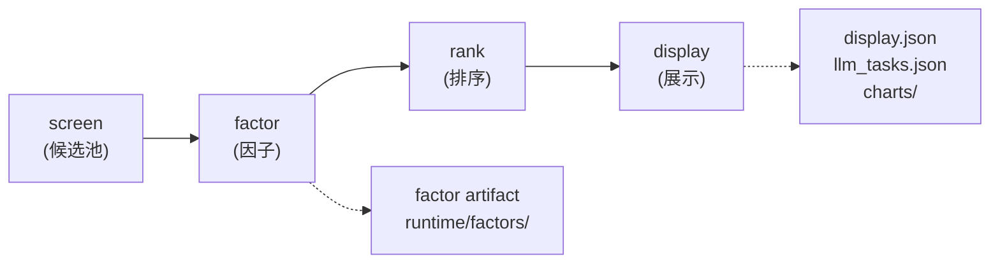
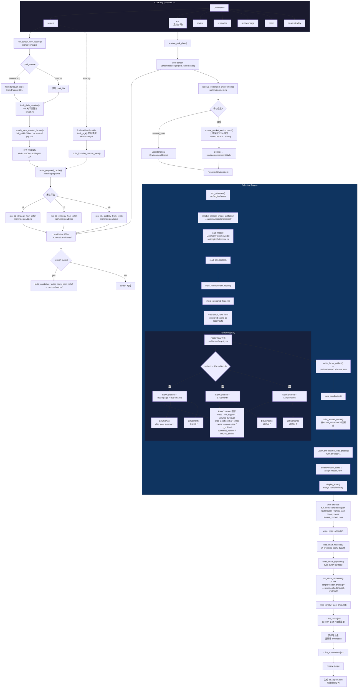

# stock-select CLI 架构

## 总览

`stock-select-rs` 是一个 Rust CLI 工具，用于 A 股选股筛选、排序和复盘。核心流程是 **screen → factor → rank → display**，以 LightGBM 模型排序为主路径。



## 二进制

```text
binary: stock-select-rs
source: src/main.rs
```

编译后安装在 `~/.cargo/bin/stock-select-rs`。

## 子命令

| 命令 | 功能 |
|------|------|
| `screen` | 筛选候选股，可选导出因子 |
| `run` | 完整流水线：screen → factor → rank → chart → review task |
| `review` | 从已有 display 生成 LLM task |
| `review-list` | 查看排序结果 |
| `review-merge` | 合并人工/LLM 复盘 annotation |
| `chart` | 生成 K 线图表 |
| `completions` | shell 补全 |

### screen

```bash
stock-select-rs screen --method b2 --pick-date 2026-06-05
stock-select-rs screen --method b2 --pick-date 2026-06-05 --export-factors
```

- 从 DB 或 Tushare API 获取行情数据
- 计算技术指标（均线、MACD、量价等）
- 按选股规则筛选候选股
- 写入 `runtime/candidates/<date>.<method>.json`
- `--export-factors` 额外导出因子到 `runtime/factors/`

当前已接入 `screen` 的方法为 `b2`、`b3`、`lsh`；各方法的股票池过滤和策略条件见 [选股筛选方法过滤条件](screening-methods.md)。

### run

```bash
stock-select-rs run --method b2 --pick-date 2026-06-05
stock-select-rs run --method b2 --llm-review-limit 5 --pick-date 2026-06-05
```

完整流水线：
1. **auto-screen** — 内部调用 screen（`export_factors: false`）
2. **环境评分** — 用上证指数/国证 2000 评估市场状态（weak / neutral / strong）
3. **selection**：
   - 加载候选 → 注入 prepared history → 计算因子 → 模型推理 → 排序 → 写 display artifact
4. **chart** — 为 top N 候选生成 K 线 PNG
5. **review task** — 生成 LLM 复盘任务文件

输出到 `runtime/select/<date>.<method>/`：
- `run.json` — 运行元信息
- `candidates.json` — 候选列表
- `factors.json` — 因子矩阵
- `ranked.json` — 排序结果
- `display.json` — 展示行（含 model_rank, model_score, llm_action 等）
- `feature_vectors.json` — 特征向量（用于调试）
- `llm_tasks.json` — LLM 复盘任务
- `llm_annotations.json` — 子代理/人工复盘 annotation
- `llm_report.html` — `review-merge` 生成的图文复盘报告
- `llm_raw/<code>.json` — 单票子代理原始复盘内容

### review-list

```bash
stock-select-rs review-list --method b2 --pick-date 2026-06-05 --limit 20
```

输出格式（tab 分隔）：

```text
rank  code    name    industry  score       bias  action  flags
1     000001  平安银行  银行       0.700000    ↑     KEEP    -
```

- `rank` — 模型排序位置（1-based）
- `score` — LightGBM 原始预测分
- `bias` — LLM 短线符号：`↑` 看多、`→` 谨慎、`↓` 看空、`-` 未复盘
- `action` — LLM 复盘动作
- `flags` — LLM 风险标记

### review / review-merge

```bash
stock-select-rs review --method b2 --pick-date 2026-06-05 --limit 5
stock-select-rs review-merge --method b2 --pick-date 2026-06-05
```

- `review` 从 `display.json` 生成 `llm_tasks.json`，包含 `chart_path`、建议的 `raw_response_path`、`llm_report_path` 和游资/短线读图提示
- `review-merge` 将填写的 `llm_annotations.json` 合并回 display，并生成 `llm_report.html`

### chart

```bash
stock-select-rs chart --method b2 --pick-date 2026-06-05 --chart-workers 4
```

生成 K 线图（含 MA25、中道/中轨、MACD、成交量）到 `runtime/charts/<date>.<method>/`。

### 通用参数

| 参数 | 说明 |
|------|------|
| `--method` | 筛选方法，当前 `screen` 支持 `b2` / `b3` / `lsh`，默认 `b2` |
| `--pick-date` | 交易日（默认取当前日期） |
| `--intraday` | 盘中模式 |
| `--runtime-root` | runtime 根目录（默认 `~/.agents/skills/stock-select/runtime`） |
| `--dsn` | PostgreSQL DSN |
| `--pool-source` | 候选池来源（`turnover-top` 等） |
| `--pool-file` | 自定义股票池文件 |

## 配置优先级

```text
CLI 参数  >  shell 环境变量  >  当前目录 .env
```

关键环境变量：

| 变量 | 说明 |
|------|------|
| `STOCK_SELECT_RUNTIME_ROOT` | runtime 根目录 |
| `POSTGRES_DSN` | PostgreSQL 连接串 |
| `TUSHARE_TOKEN` | Tushare API token |
| `STOCK_SELECT_BIN` | 二进制路径（用于脚本） |

## Runtime 目录布局

```text
runtime/
├── candidates/         候选 JSON
│   └── <date>.<method>.json
├── factors/            因子矩阵
│   └── <date>.<method>/
│       ├── factors.json
│       └── manifest.json
├── select/             排序结果
│   └── <date>.<method>/
│       ├── run.json
│       ├── candidates.json
│       ├── factors.json
│       ├── ranked.json
│       ├── display.json
│       ├── feature_vectors.json
│       ├── llm_tasks.json
│       └── llm_annotations.json
├── charts/             K 线图
│   └── <date>.<method>/
│       └── <code>_day.png
├── models/             模型产物
│   ├── b2/
│   │   ├── model.txt            (LightGBM booster)
│   │   └── model_metadata.json  (特征元信息)
│   └── archive/        历史归档
├── prepared/           预处理缓存
└── environment/        环境状态
    └── daily/
```

# 运行时架构全图



## 数据流

```mermaid
flowchart LR
    PG[("PostgreSQL<br/>daily_market")] --> SC["screening"]
    SC --> CJ["candidates JSON"]

    CJ --> CPI["inject prepared history"]
    CPI --> FP["CandidatePayload<br/>FactorProvider"]
    FP --> FR["FactorRow<br/>(技术指标 + 量价因子)"]

    FR --> BF["build_feature_vector"]
    BF --> LGB["LightGBM predict"]
    LGB --> MS["model_score (f64)"]

    MS --> SORT["sort by score ↓"]
    SORT --> RC["RankedCandidate<br/>model_rank (usize)"]

    RC --> MERGE["merge name / industry"]
    MERGE --> DR["DisplayRow"]
    DR --> RL["display.json<br/>→ review-list"]
```


