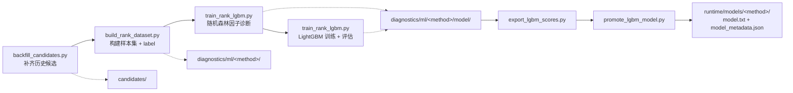

# 模型系统

## 总览

当前生产主路径是 **b2 LightGBM model-first** 架构。模型使用 LambdaRank 算法训练，对候选股进行排序，`model_rank` 和 `model_score` 决定最终展示顺序。LLM/人工复盘只做 annotation（风险标记、备注），不改 rank。

训练、导出、发布和回滚脚本按 `--method` 维护产物，可用于 b2/b3 等类别；生产 `run/review` 是否能实际使用某个 method，取决于 Rust CLI 对该 method 的 capability，不接入 Python predict。



## 训练流程

### 1. 补齐历史候选

```bash
METHOD=b2

uv run scripts/ml/backfill_candidates.py \
  --method "$METHOD" \
  --start-date <TRAIN_START> \
  --end-date <TRAIN_END> \
  --workers 16
```

- 从 DB 读取每日行情
- 运行 screen 逻辑生成历史候选
- 写入 `runtime/candidates/<date>.<method>.json`

### 2. 构建训练集

```bash
uv run scripts/ml/build_rank_dataset.py \
  --method "$METHOD" \
  --runtime-root runtime \
  --source candidates \
  --start-date <TRAIN_START> \
  --end-date <TRAIN_END>
```

- 加载候选 → 按 code+date 关联因子
- 从 DB 获取未来 3 日/5 日涨幅作为 label
- 每个交易日独立排序，生成分档标签：

| label | quartile | 含义 |
|-------|----------|------|
| 3 | top 25% | 未来 3 日涨幅最高 |
| 2 | 中上 25% | |
| 1 | 中下 25% | |
| 0 | bottom 25% | 未来 3 日涨幅最低 |

- 输出 CSV 到 `diagnostics/ml/<method>/rank_dataset.csv`

### 3. 训练

```bash
uv run scripts/ml/train_rank_lgbm.py \
  --method "$METHOD" \
  --dataset "diagnostics/ml/$METHOD/rank_dataset.csv" \
  --output-dir "diagnostics/ml/$METHOD/model" \
  --feature-set raw_numeric \
  --num-leaves 9 \
  --min-data-in-leaf 120 \
  --num-boost-round 60 \
  --learning-rate 0.05 \
  --num-threads 16 \
  --rolling-folds 5 \
  --rolling-train-dates 240 \
  --rolling-test-dates 40
```

`train_rank_lgbm.py` 默认在 LightGBM 前运行随机森林因子诊断，用同一份特征选择、one-hot 编码、时间切分和 label 口径确认因子有效性。诊断产物写入同一输出目录：

```text
diagnostics/ml/<method>/model/rf_feature_diagnostics.json
diagnostics/ml/<method>/model/rf_feature_diagnostics.md
```

LightGBM report 的 `rf_diagnostics` 字段会嵌入随机森林摘要，包括诊断状态、OOB、测试集 RankIC、Top features 和低重要性因子数量。随机森林只用于训练前诊断，不进入 Rust 生产推理；快速冒烟或依赖不可用时可传 `--skip-rf-diagnostics` 跳过，但正式候选 trial 应保留诊断。

可选门禁参数：

| 参数 | 说明 |
|------|------|
| `--rf-min-oob-score` | OOB 低于阈值时停止 LightGBM 训练 |
| `--rf-min-test-rank-ic-ret3` | 随机森林测试集 `rank_ic_ret3` 低于阈值时停止 LightGBM 训练 |

训练参数：

| 参数 | 值 | 说明 |
|------|------|------|
| objective | `lambdarank` | 排序学习目标 |
| metric | `ndcg` | 归一化折损累积增益 |
| label_gain | `[0, 1, 3, 7]` | label 0→0, 1→1, 2→3, 3→7 |
| num_leaves | 9 | 树叶子节点数 |
| min_data_in_leaf | 120 | 叶子最少样本 |
| num_boost_round | 60 | 迭代轮数 |
| seed | 17 | 随机种子 |

评估指标：

| 指标 | 说明 |
|------|------|
| top3_ret3_positive_rate | Top3 候选 3 日正收益率比例 |
| top3_ret3_ge_5_rate | Top3 涨幅≥5% 比例 |
| top3_ret3_le_0_rate | Top3 涨幅≤0 比例 |
| rank_ic_ret3 | 排序 IC（秩相关系数） |
| top3_ret5_ge_5_rate | Top3 5 日涨幅≥5% 比例 |

### 4. 导出模型

```bash
uv run scripts/ml/export_lgbm_scores.py \
  --method "$METHOD" \
  --model-output-dir "diagnostics/ml/$METHOD/model"
```

- 对诊断数据打分
- 输出 score CSV 到 diagnostics
- 若 `--model-output-dir` 指向 `diagnostics/ml/$METHOD/tuning/<trial>`，默认 feature manifest、score CSV 和 summary 都跟随该 trial 目录

### 5. 发布模型

```bash
# 预览
uv run scripts/ml/promote_lgbm_model.py \
  --method "$METHOD" \
  --candidate-dir "diagnostics/ml/$METHOD/model" \
  --dry-run \
  --require-report

# 正式发布
uv run scripts/ml/promote_lgbm_model.py \
  --method "$METHOD" \
  --candidate-dir "diagnostics/ml/$METHOD/model" \
  --require-report

# 回滚
uv run scripts/ml/promote_lgbm_model.py \
  --method "$METHOD" \
  --rollback <archive-version>
```

发布后产物在 `runtime/models/<method>/`：

```text
runtime/models/<method>/
├── model.txt              # LightGBM booster 序列化
├── model_metadata.json    # 特征元信息
├── model_card.json        # 发布摘要
└── feature_manifest.json  # 特征清单
```

归档在 `runtime/models/archive/<method>/<version>/`。

## 推理

### 特征向量构建

`build_feature_vector()`（`src/engine/inference.rs`）过程：

1. 从 `FactorRow` 中提取 `metadata.numeric_columns` 对应的数值特征
2. 缺失的数值特征补 `0.0`
3. 对 `metadata.categorical_columns` 做 one-hot 编码
4. 特征顺序严格对齐 `metadata.feature_names`

```rust
pub struct BuiltFeatureVector {
    pub feature_names: Vec<String>,
    pub values: Vec<f64>,
    pub missing_numeric_features: Vec<String>,
}
```

### 模型加载

```rust
pub struct LightGbmRuntimeModel {
    booster: lightgbm3::Booster,
}
```

- 从 `model.txt` 文件加载 LightGBM booster
- 推理时调用 `predict(&[f64])` 返回原始预测分
- 强制单线程推理（`num_threads=1`）

### 打分排序

```rust
fn rank_candidates(...) -> Vec<RankedCandidate> {
    // 1. 为每个候选计算特征向量
    // 2. 模型 predict 得到 model_score
    // 3. 按 score 倒序排序
    // 4. 分配 model_rank（从 1 开始）
}
```

## 模型维护脚本

统一入口 `scripts/model_maintenance.sh`：

| 命令 | 功能 |
|------|------|
| `--method <method> status` | 查看当前激活模型 |
| `--method <method> archives` | 列出当前 method 的归档版本 |
| `--method <method> dry-run-promote <dir>` | 预览发布 |
| `--method <method> promote <dir>` | 正式发布 |
| `--method <method> switch <version>` | 切换活跃模型 |
| `--method <method> rollback <version>` | 回滚到指定版本 |

## 因子系统

因子在 `src/factors/` 中定义，通过 `registry.rs` 注册：

| 模块 | 因子 |
|------|------|
| `ma.rs` | 均线相关（MA5, MA25, 均线斜率等） |
| `macd.rs` | MACD 指标（DIF, DEA, 柱状图, 金叉死叉） |
| `volume.rs` | 成交量相关（量比, 均量比） |
| `price_position.rs` | 价格位置（箱体位置, 高/低点比例） |
| `abnormal_volume.rs` | 异常放量检测 |
| `semantic.rs` | 语义因子（趋势结构, 波动率等） |
| `series.rs` | 时间序列辅助函数 |
| `zx.rs` | 中道/中轨线 |

因子数据流：

```text
screening 阶段:
  行情数据 → 技术指标计算 → raw_payload (JSON)

run 阶段:
  raw_payload → CandidatePayloadFactorProvider.factor_row()
    ├── 顶层信号字段 (close, turnover_n, signal, env)
    ├── raw_payload.factors (已有计算因子)
    └── history → history_factor_fields() (历史窗口因子)

  → FactorRow { code, method, factors: BTreeMap<String, FactorValue> }
```

`FactorValue` 枚举：

```rust
pub enum FactorValue {
    Number(f64),
    Category(String),
    Bool(bool),
}
```

## 评分规则

b2 评分系统（`src/reviewers/b2_scoring.rs`）在模型排序之外提供规则化评分，用于 PASS/WATCH/FAIL 判定：

| 评分维度 | 函数 | 范围 | 说明 |
|----------|------|------|------|
| trend_structure | `score_b2_trend_structure()` | 1-5 | 趋势结构（多周期均线排列、顶背离） |
| price_position | `score_b2_price_position()` | 1-5 | 价格在 120 日箱体中的位置 |
| volume_behavior | `score_b2_volume_behavior()` | 1-5 | 量价配合（放量突破、缩量调整） |
| previous_abnormal_move | `score_b2_previous_abnormal_move()` | 1-5 | 前 90 日异常放量后的回调深度 |
| macd_phase | (环境传入) | 1-5 | MACD 相位（金叉、强多头、顶背离等） |

`infer_b2_verdict()` 综合上述评分判断：

| verdict | 含义 |
|---------|------|
| PASS | 强信号，综合评分和结构满足买入条件 |
| WATCH | 中等信号，可关注（细分为 A/B/C 三级） |
| FAIL | 不满足条件 |

WATCH 分级（`infer_b2_watch_tier()`）：

| 级别 | 条件 |
|------|------|
| WATCH-A | 弹性观察 + score ≥ 65 |
| WATCH-B | score ≥ 50 |
| WATCH-C | 其他 |
