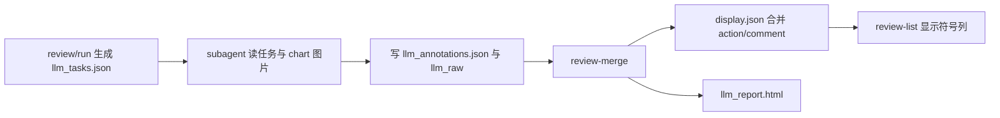

# LLM 游资复盘报告设计

## 背景

当前 `stock-select-rs` 已有 `review -> llm_tasks.json -> llm_annotations.json -> review-merge -> review-list` 流程，但 `review-list` 只能看到 `llm_action` 和风险标签，`llm_comment` 没有合并到 `display.json`，也没有面向子代理读图结果的 HTML 报告。用户希望借鉴 UZI-Skill 的游资提示词，让子代理读取 `llm_tasks.json` 指定股票与 chart 图片后给出评价；列表只显示看多/看空符号，详细评价放在对应产物目录。

## 目标

- `review-list` 增加一个短线情绪符号列：`KEEP` 映射 `↑`，`CAUTION` 映射 `→`，`REJECT` 映射 `↓`，未复盘为 `-`。
- `review-merge` 合并 `llm_comment` 到 `display.json`，但不改变 `model_rank` 或 `model_score`。
- `review-merge` 在 `runtime/select/<key>.<method>/llm_report.html` 生成可打开的 HTML 报告。
- `llm_tasks.json` 内的提示词改为 UZI 游资/短线读图口径，要求子代理同时产出 annotation 和原始复盘内容。
- `.agents/skills/stock-select` 同步描述新的 prompt、报告路径和 review-list 展示方式。

## 非目标

- 不在 Rust CLI 内自动调用 LLM 或 subagent。
- 不接入 UZI-Skill 的数据抓取链路、龙虎榜抓取或投资者投票系统。
- 不让 LLM 改写模型排序。

## 数据流

## HTML 报告

报告写入 `select/<artifact_key>.<method>/llm_report.html`。每只股票展示模型 rank、score、代码名称、行业、短线符号、action、risk flags、comment、chart 图片和 raw response。报告只引用已有 chart 相对路径，不复制图片。

## 测试

- 展示层单测覆盖 `KEEP/CAUTION/REJECT` 到符号的映射和输出列。
- CLI 复盘流测试覆盖 comment 合并、HTML 文件生成、chart 图片引用和 HTML 转义。
- CLI review 测试覆盖 task prompt 包含游资/题材/龙虎榜/短线要求。
