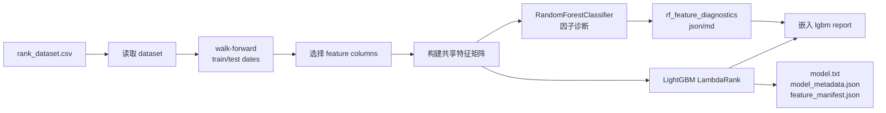

# 随机森林因子诊断设计

## 背景

当前模型训练主路径是 `build_rank_dataset.py -> train_rank_lgbm.py -> export_lgbm_scores.py -> promote_lgbm_model.py`。`train_rank_lgbm.py` 负责选择训练特征、构建 one-hot 特征矩阵、训练 LightGBM LambdaRank 模型，并写出 `feature_manifest.json`、`model.txt`、`model_metadata.json` 和 `lgbm_rank_report*.json/md`。

用户希望在 LightGBM 训练前引入随机森林算法，用于确认因子有效性；同时希望训练前诊断报告与训练模型产物结合，后续模型维护 skill 也要指导 agent 汇报该诊断结果。

## 目标

- 在 `train_rank_lgbm.py` 训练 LightGBM 前，默认运行随机森林因子诊断。
- 随机森林诊断复用 LightGBM 的特征选择、one-hot 编码、训练/测试日期切分和 label 解析逻辑，避免两套特征口径。
- 每个训练输出目录写出 `rf_feature_diagnostics.json` 和 `rf_feature_diagnostics.md`。
- `lgbm_rank_report*.json/md` 嵌入随机森林诊断摘要，让候选模型和训练前诊断绑定在同一 trial 目录。
- 支持可选阈值阻断；未显式配置阈值时，只报告、不阻止 LightGBM 训练。
- 更新 `docs/model.md`、`.agents/skills/model-maintenance/SKILL.md` 和 reference，让后续训练/调参汇报包含随机森林诊断。

## 非目标

- 不把随机森林模型发布到 `runtime/models/<method>/`。
- 不让 Rust CLI 生产推理依赖 Python 或随机森林。
- 不在初版自动剔除低重要性因子；低贡献因子只在报告中标记，是否删除由后续调参或人工决策处理。
- 不替代现有 LightGBM rolling 指标、promote dry-run 或模型发布门禁。

## 总体方案

采用集成方案：在 `train_rank_lgbm.py` 内新增随机森林诊断步骤，默认启用。训练脚本在确定 `train_rows`、`test_rows`、`numeric_columns`、`categorical_columns` 和 `fixed_categorical_levels` 后，先运行随机森林诊断，再进入现有 LightGBM 训练。



## CLI 参数

新增参数：

- `--rf-diagnostics`：启用随机森林诊断，默认开启；与 `--skip-rf-diagnostics` 互斥。
- `--skip-rf-diagnostics`：跳过随机森林诊断，用于依赖缺失、快速冒烟或只验证 LightGBM 管线。
- `--rf-n-estimators`：随机森林树数量，默认 `300`。
- `--rf-max-depth`：树最大深度，默认不限制。
- `--rf-min-samples-leaf`：叶子最少样本，默认 `20`。
- `--rf-max-features`：每棵树分裂时考虑的特征数量，默认 `sqrt`。
- `--rf-min-oob-score`：可选阈值；OOB 固定开启，得分低于该值时阻止 LightGBM 训练。
- `--rf-min-test-rank-ic-ret3`：可选阈值；若随机森林测试集 `rank_ic_ret3` 低于该值，则阻止 LightGBM 训练。

默认参数偏保守，重点是稳定排序和因子筛查，不追求随机森林本身成为生产模型。

## 诊断算法

随机森林使用 `sklearn.ensemble.RandomForestClassifier`，固定 `random_state=17`、`bootstrap=True`、`oob_score=True`。输入矩阵由现有 `build_feature_matrix()` 生成，标签由现有 `labels(..., label_column=...)` 生成。训练集和测试集沿用 LightGBM 的时间切分，不做随机打乱，避免未来信息泄漏。

诊断会对测试集输出 `model_score`：

- 对多分类 label，优先使用每个类别概率和 label gain 的加权和作为 score。
- 对二分类派生 label，使用正类概率映射为 score。
- 若概率列异常缺失，则降级为 `predict()` 的 label 数值。

然后复用 `evaluate_model()` 计算与 LightGBM 报告一致的 Top3 和 RankIC 指标。这样随机森林诊断既能看特征重要性，也能用现有选股指标衡量诊断模型是否捕捉到收益排序信号。

## 报告结构

`rf_feature_diagnostics.json` 顶层字段：

- `enabled`
- `status`：`passed`、`failed_threshold`、`skipped`
- `label_column`
- `feature_count`
- `numeric_feature_count`
- `categorical_feature_count`
- `params`
- `thresholds`
- `metrics.train`
- `metrics.test`
- `oob_score`
- `accuracy.train`
- `accuracy.test`
- `top_features`
- `low_importance_features`
- `output_paths`

`top_features` 记录前 50 个特征及 importance。`low_importance_features` 记录 importance 小于等于 `1e-6` 的特征，作为后续人工排查清单，不自动写入 `excluded_features`。

`lgbm_rank_report*.json` 增加 `rf_diagnostics` 摘要字段：

- `path`
- `status`
- `oob_score`
- `metrics.test`
- `top_features` 前 20 项
- `low_importance_feature_count`

Markdown 报告增加 `## random forest factor diagnostics` 小节，列出诊断状态、OOB、测试集 Top3/RankIC 和前 20 个特征。

## 阈值和失败策略

默认只报告、不阻断。只有用户显式传入 `--rf-min-oob-score` 或 `--rf-min-test-rank-ic-ret3` 时，随机森林诊断才参与 LightGBM 训练门禁。

门禁失败时：

- 写出 `rf_feature_diagnostics.json/md`。
- 不训练 LightGBM，不写新的 `model.txt`。
- 抛出明确错误，说明失败指标、阈值和诊断报告路径。

如果用户传 `--skip-rf-diagnostics`：

- `lgbm_rank_report*.json` 中写入 `rf_diagnostics.enabled=false` 和 `status=skipped`。
- 训练流程按现有 LightGBM 行为继续。

## 依赖

`train_rank_lgbm.py` 的 uv script dependencies 新增 `scikit-learn`。单元测试中通过 mock `sklearn` 覆盖主流程，避免测试必须跑真实随机森林。

## 与发布流程的关系

随机森林诊断是训练前质量检查，不是生产模型。`promote_lgbm_model.py` 的必需产物仍为：

- `model.txt`
- `model_metadata.json`
- `feature_manifest.json`
- `lgbm_rank_report*.json`

发布脚本可以读取 `lgbm_rank_report*.json` 中的 `rf_diagnostics` 并写入 `model_card.json` 摘要，但不要求 `rf_feature_diagnostics.json` 作为独立发布文件。若后续需要强制发布前必须存在诊断摘要，应另行设计。

## 文档和 skill 更新

`docs/model.md`：

- 在训练流程图中加入随机森林因子诊断节点。
- 在训练步骤中说明默认会生成 `rf_feature_diagnostics.json/md`。
- 在训练报告字段中解释 `rf_diagnostics` 与 LightGBM 指标的区别。

`.agents/skills/model-maintenance/SKILL.md`：

- 更新训练命令说明，提示默认训练前运行随机森林诊断。
- 更新训练完成汇报要求，加入随机森林 Top features、OOB、测试 RankIC、低重要性因子数量和阈值状态。
- 明确随机森林不进入生产推理，不替代 promote dry-run。

`.agents/skills/model-maintenance/references/model-maintenance.md`：

- 更新 trial 目录产物清单。
- 更新调参报告检查项和停止条件。
- 更新推荐汇报模板。

## 测试计划

严格按 TDD 小步实现：

- `parse_args` 覆盖新增随机森林参数和 `--skip-rf-diagnostics`。
- 新增诊断函数单测：使用 fake sklearn，验证共享特征矩阵、label、feature importance 排序和指标输出。
- `train_and_report` 单测：默认写出 `rf_feature_diagnostics.json/md`，并在 `lgbm_rank_report*.json` 嵌入摘要。
- 阈值失败单测：低于阈值时写出诊断报告并阻止 LightGBM 训练。
- 跳过诊断单测：`--skip-rf-diagnostics` 时不调用 sklearn，LightGBM 训练继续。
- 文档测试：验证模型维护文档包含随机森林诊断产物和汇报要求。

验证命令：

```bash
python -m unittest tests/test_rank_lgbm.py tests/test_ml_documentation.py
python -m py_compile scripts/ml/train_rank_lgbm.py
```

若改动影响发布脚本摘要，再补跑：

```bash
python -m unittest tests/test_lgbm_model_promotion.py
```

## 验收标准

- 默认运行 `train_rank_lgbm.py` 会先生成随机森林因子诊断，再训练 LightGBM。
- 每个 trial 目录内 LightGBM 报告能直接看到随机森林诊断摘要。
- 未配置阈值时，随机森林弱表现不会中断训练；配置阈值时，低于阈值会阻止 LightGBM 训练并保留诊断报告。
- `model_metadata.json` 和 Rust 推理行为不因随机森林诊断改变。
- model-maintenance skill 的训练汇报要求包含随机森林诊断结论。
